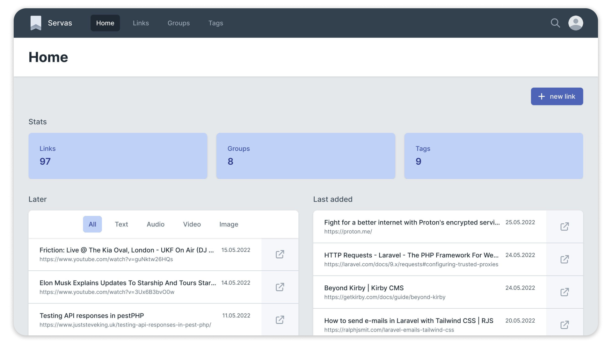
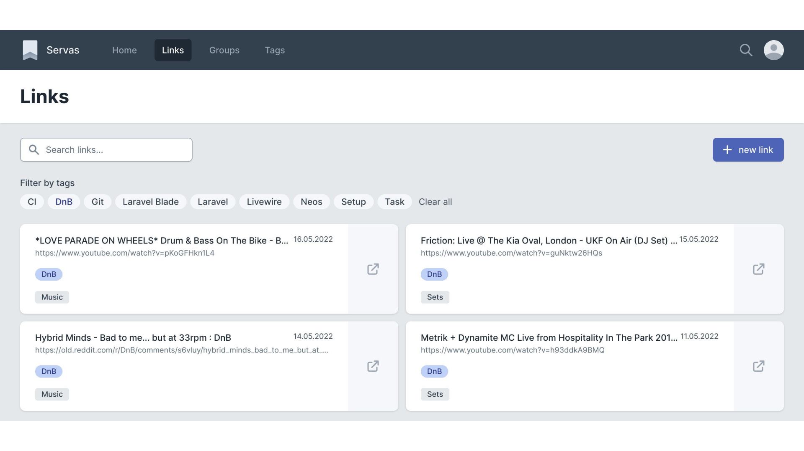
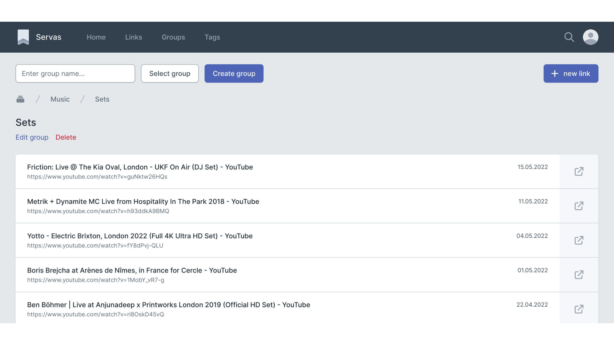
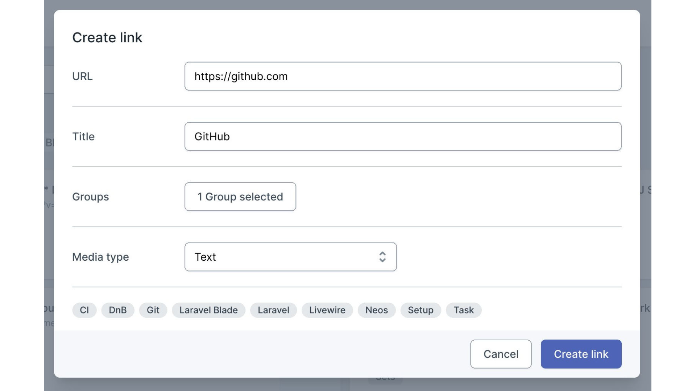
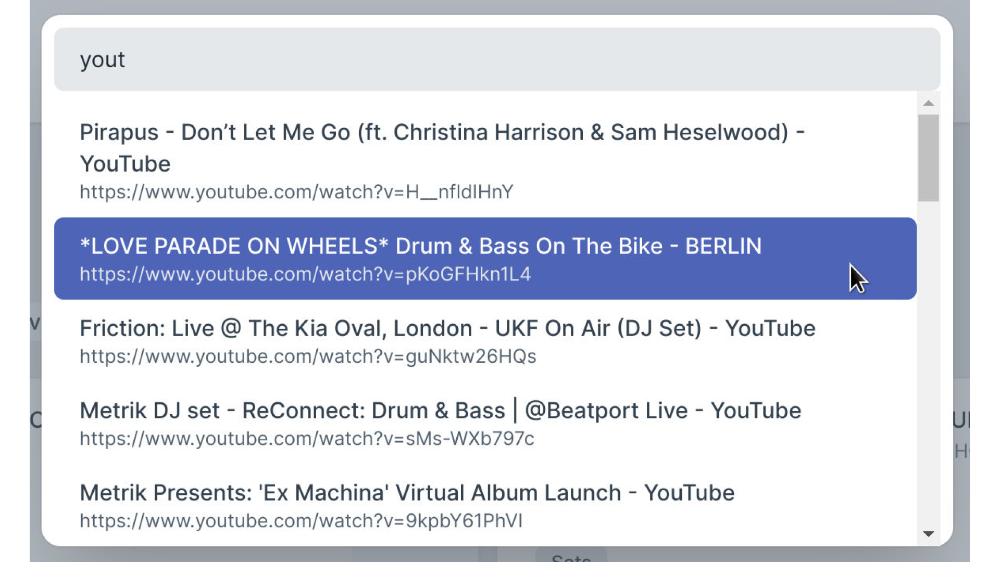

# Servas

A self-hosted bookmark management tool.  
Servas is based on Laravel and Inertia.js and uses Tailwind CSS and Svelte for the frontend.



## Features

- **Tags:** Organize your bookmarks with tags.
- **Groups:** Group your bookmarks. Groups can be nested.
- **Smart Groups:** Group your bookmarks based on their belonging tags.
- **Firefox and Chrome browser extension:** Add sites to Servas right from your browser.
- **Multiple users:** You can create multiple user accounts.
- **Responsive design:** Servas looks good on all your devices.
- **Dark/light theme.**
- **Two Factor Authentication available.**

## How to install

### Docker

Servas is available as an [official Docker image](https://hub.docker.com/r/beromir/servas).

The preferred way to use Servas is with **SQLite**. This variant does not need an additional database container.  
You can find the example files here:

- [compose.yaml](docker/compose.prod.yaml)
- [.env](docker/.env.prod.example)

The Docker image also supports **MySQL** and **MariaDB**.  
You can find the example files here:

- [compose.yaml](docker/mariadb-example/compose.prod.yaml)
- [.env](docker/mariadb-example/.env.prod.example)

**Initial steps:**

1. Create `.env` file in the directory where the `compose.yaml` is located.
2. Copy the content of the example env file into the `.env` file.
3. Change the `APP_URL`.
4. Use a strong password for the `DB_PASSWORD` setting (only required if Servas is used with MariaDB).
5. Start the containers with `docker compose up -d`.
6. Generate the application key:

```shell
docker exec -it servas php artisan key:generate --force
```

7. Restart the containers with `docker compose restart`.
8. Open your browser and create a user account at https://your-servas-instance/register.

### Manual

**Requirements:**

- PHP 8.3
- MariaDB, MySQL or SQLite
- Git
- Node.js
- Composer

1. Clone the repo.
2. Install the Composer packages.

```shell
composer install --optimize-autoloader --no-dev
```

3. Install the npm packages.

```shell
npm install
```

4. Compile the assets.

```shell
npm run build
```

5. Create `.env` file from the `.env.example` file.
6. Change the settings in the `.env` file according to your needs.
7. If you are using SQLite, you must remove the MySQL section in the `.env` file and uncomment the SQLite section.
8. Run the database migrations.

```shell
php artisan migrate
```

9. Generate the application key.

```shell
php artisan key:generate
```

## Configuration

You can change some application settings in the `.env` file.

| Description                                  | `.env` key                   | Options        |
|:---------------------------------------------|:-----------------------------|:---------------|
| Enable/Disable user registration             | `SERVAS_ENABLE_REGISTRATION` | `true`/`false` |
| Show/Hide version number in profile dropdown | `SERVAS_SHOW_APP_VERSION`    | `true`/`false` |

After making changes to the `.env` file, you must restart the application container.

## User Guide

Register a new user at https://your-servas-instance/register.

## Browser Extensions

**Firefox and Chrome:** https://github.com/beromir/servas-extension

## Screenshots

Links view:


Groups view:


New link modal:


Command palette:

