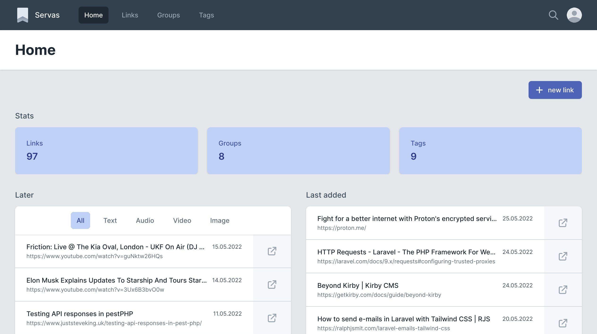
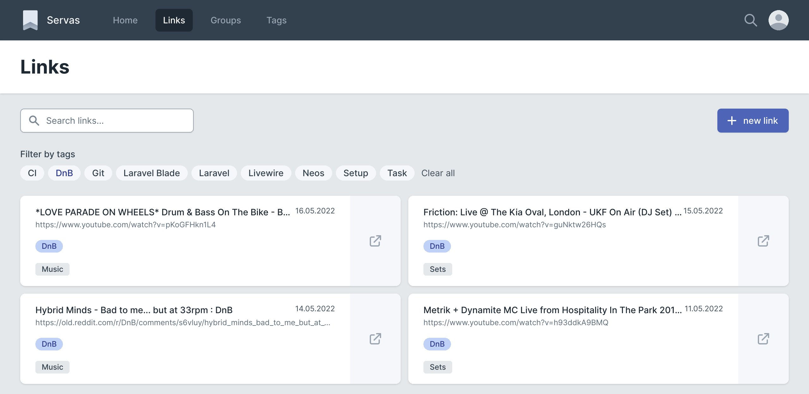
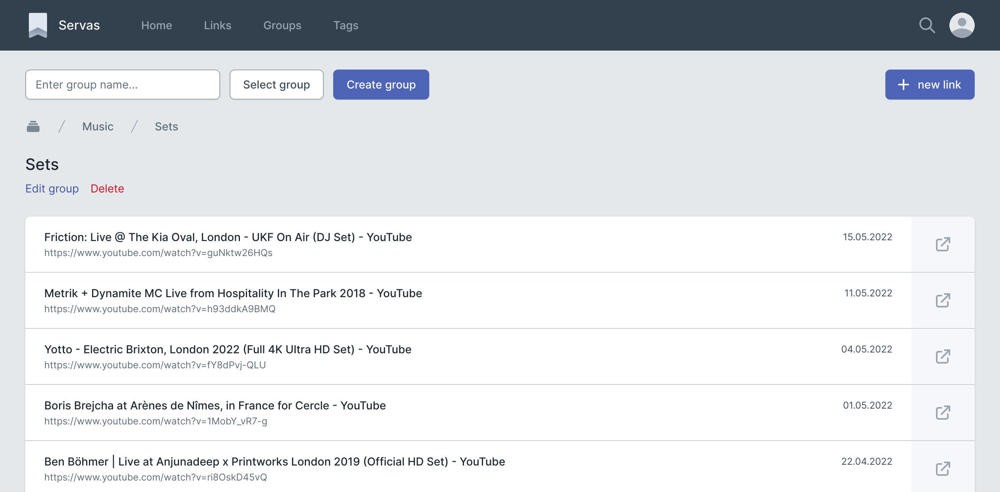
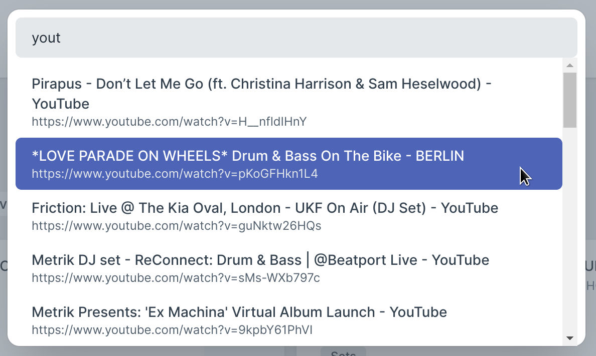

# Servas
A self-hosted bookmark management tool.

## Features
- **Tags:** Organize your bookmarks with tags.
- **Groups:** Group your bookmarks. Groups can be nested.
- **Later list:** Add bookmarks to the "later list" to access them later.
- **Chrome browser extension:** Add sites to Servas right from your browser.
- **Multiple users:** You can create multiple accounts.
- **Two Factor Authentication available.**

## How to install
### Docker
[Docker Compose file](./docker/docker-compose.prod.yaml)

### Manual

## Screenshots

Links view

Groups view

New link modal

Command palette
